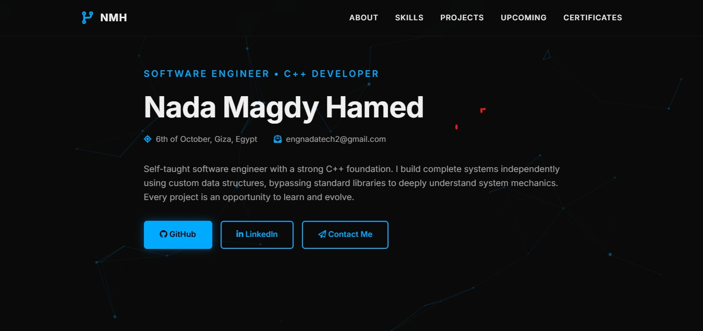
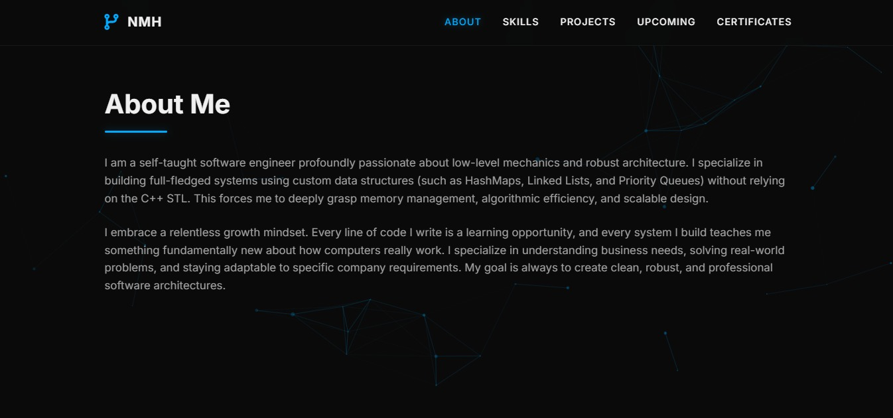
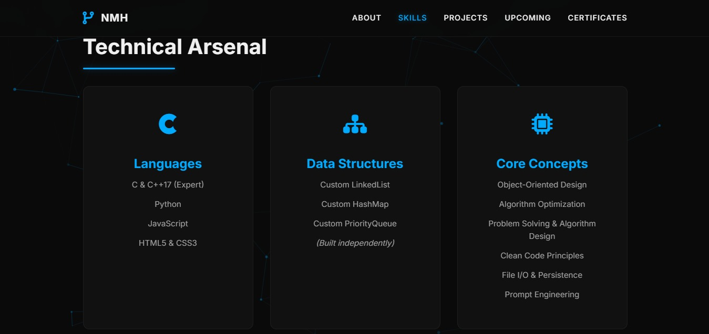
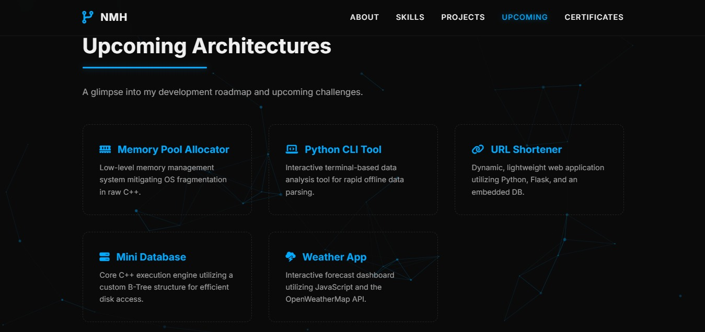

# ⚡ Nada Magdy Hamed
### Software Engineer • C++ Developer

📍 6th of October, Giza, Egypt

---

## 🏠 Portfolio Preview

---

## 👩‍💻 About Me

Self-taught software engineer with a strong **C++ foundation**, passionate about low-level mechanics and robust architecture. I build complete systems **independently** using custom data structures — bypassing standard libraries to deeply understand how computers really work.

> *"Every line of code is a learning opportunity. Every system I build teaches me something fundamentally new."*

---

## 🛠️ Technical Arsenal

### Languages

### Data Structures *(Built Independently)*
- 🔗 Custom LinkedList
- 🗺️ Custom HashMap
- 📊 Custom PriorityQueue

### Core Concepts
- Object-Oriented Design
- Algorithm Optimization
- Problem Solving & Algorithm Design
- Clean Code Principles
- File I/O & Persistence
- Prompt Engineering

### Frontend & Backend

Responsive Design • API Integration • Python Scripting

### Tools

### Languages Spoken
🇸🇦 Arabic (Native) • 🇬🇧 English (B2) • 🇩🇪 German (A1)

---

## 🚀 Upcoming Architectures

| Project | Description |
|--------|-------------|
| 🧠 **Memory Pool Allocator** | Low-level memory management system mitigating OS fragmentation in raw C++ |
| 🖥️ **Python CLI Tool** | Interactive terminal-based data analysis tool for rapid offline data parsing |
| 🔗 **URL Shortener** | Dynamic, lightweight web app using Python, Flask & embedded DB |
| 🗄️ **Mini Database** | C++ execution engine with custom B-Tree structure for efficient disk access |
| 🌤️ **Weather App** | Interactive forecast dashboard using JavaScript & OpenWeatherMap API |

---

## 🏆 Certifications

- 🎓 **Gammal Tech Diploma (2025–2026)** — C, C++, Data Structures, Algorithms, OOP, Frontend & UI/UX
- 🏅 **Digital Egypt Cubs Initiative** — Premium Award by the Ministry of Communications and IT (MCIT)
- 🇩🇪 **German Language A1** — Grade A at Deniz Language Center

---

## 🤝 Let's Connect

> *"Whether you have a question, a project proposal, or just want to discuss software architecture — I'm always eager to talk tech."*

📧 [engnadatech2@gmail.com](mailto:engnadatech2@gmail.com)
📱 +20 10 1996 8520
🌐 [nadanagdyportfolio.netlify.app](https://nadanagdyportfolio.netlify.app/)

---

*Built with passion, curiosity, and zero shortcuts* ⚡

